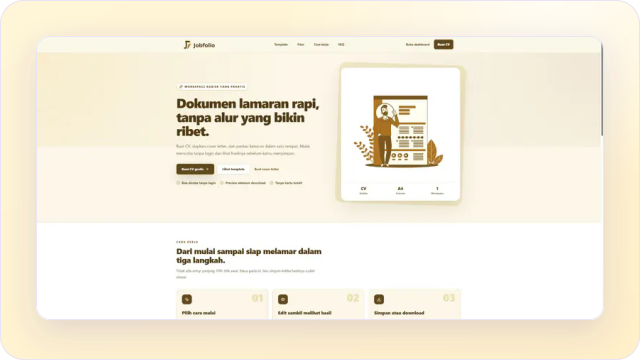
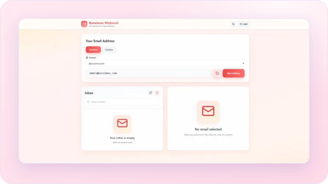
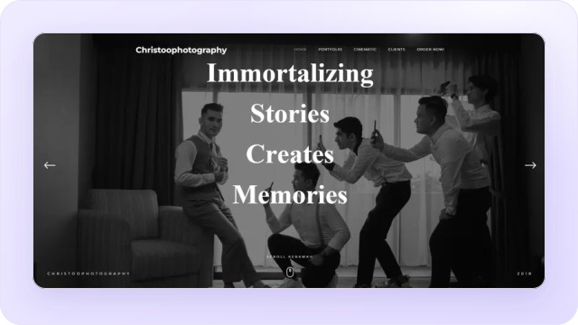

  <picture>
    <source media="(max-width: 600px)" srcset="assets/header-mobile.svg" />
    
  </picture>
    
  &nbsp;
  &nbsp;
  &nbsp;
  
    
  <a href="#about">About</a> &nbsp;&middot;&nbsp;
  <a href="#selected-work">Selected work</a> &nbsp;&middot;&nbsp;
  <a href="#toolbox">Toolbox</a> &nbsp;&middot;&nbsp;
  <a href="#activity">Activity</a>

## About

I'm a software engineer who enjoys owning a product end to end, from the first screen to the server it runs on. I build web and mobile apps, run my own infrastructure, and put machine learning to work where it actually helps. Most of my day-to-day work happens in private repositories, so this page highlights what I can share.

- **Building:** full-stack products with Next.js, React, Node.js, Laravel, and PostgreSQL
- **Running:** self-hosted services on Linux with Docker, behind Cloudflare
- **Applying:** computer vision in real products, from license-plate reading to face-recognition attendance
- **Open to:** freelance projects and collaborations. [Get in touch &#8599;](https://kuraimos.com/#contact)

## Selected work

Recent products and client work. More on [kuraimos.com](https://kuraimos.com/#projects).

<table>
  <tr>
    <td width="50%" valign="top">
      
      <h3>Jobfolio</h3>
      
A CV and cover-letter builder with an interactive editor, responsive templates, and PDF export.

      
<code>Next.js</code> <code>TypeScript</code> <code>PostgreSQL</code> <code>Docker</code> <code>Tailwind CSS</code>

      
<a href="https://jobfolio.kuraimos.com">Live site &#8599;</a>

    </td>
    <td width="50%" valign="top">
      
      <h3>Webmail</h3>
      
A React client and Hapi API for a self-hosted, multi-domain mail server with a real-time inbox.

      
<code>React</code> <code>TypeScript</code> <code>Hapi</code> <code>PostgreSQL</code> <code>Docker</code>

      
<a href="https://webmail.kuraimos.com">Live site &#8599;</a>

    </td>
  </tr>
  <tr>
    <td width="50%" valign="top">
      
      <h3>SNap &amp; Style payments</h3>
      
Payment gateway integration for a creative-services marketplace: checkout, signed webhooks, and status sync for every transaction state.

      
<code>Laravel</code> <code>SQLite</code> <code>Payment gateway</code>

      
<a href="https://snapnstyle.id">Live site &#8599;</a>

    </td>
    <td width="50%" valign="top">
      
      <h3>Plat Detection API</h3>
      
Reads vehicle license plates from a photo and looks up the registration region (Samsat).

      
<code>Go</code> <code>Python</code> <code>OpenCV</code> <code>NumPy</code>

      
<a href="https://platdetection.kuraimos.com">Live site &#8599;</a> &nbsp;&middot;&nbsp; <a href="https://github.com/kuraimoss/UAS-MachineLearning">Source</a>

    </td>
  </tr>
  <tr>
    <td width="50%" valign="top">
      
      <h3>kuraBOT</h3>
      
A WhatsApp assistant that combines AI tools, media downloads, and group administration.

      
<code>Node.js</code> <code>Express</code> <code>OpenAI API</code>

      
<a href="https://wa.me/6283140919553?text=Haloo%20kuraBOT">Chat on WhatsApp &#8599;</a>

    </td>
    <td width="50%" valign="top">
      
      <h3>Full-Stack Photography</h3>
      
A photography portfolio with an admin workspace for client quotations and invoices.

      
<code>Node.js</code> <code>Express</code> <code>SQLite</code> <code>Python</code>

      
<a href="https://christoophotography.com">Live site &#8599;</a>

    </td>
  </tr>
</table>

### More projects

- **Face-recognition attendance:** teacher attendance with ArcFace recognition, liveness detection, GPS validation, and Excel reports. `Python` `FastAPI` `PostgreSQL` `OpenCV`
- **MentalCare:** an expert system for early detection of teen mental-health issues using Dempster–Shafer. `Laravel` `MySQL` `Tailwind CSS` · [Demo](https://mentalcare.kuraimos.com) · [Source](https://github.com/kuraimoss/skripsiSepti)
- **Cloud Storage:** a personal cloud to upload, organize, and share files. `Node.js` `Express` `Bootstrap` · [Demo](https://cloudstorage.kuraimos.com) · [Source](https://github.com/kuraimoss/cloud-storage)
- **Media Downloader:** download video or audio from YouTube, Instagram, and TikTok by URL. `Node.js` `Express` · [Demo](https://mediadownloader.kuraimos.com)
- **Lucky Draw:** a fair, interactive name picker for live events and giveaways. `Hapi` `Node.js` · [Demo](https://luckydraw.kuraimos.com) · [Source](https://github.com/kuraimoss/luckydraw)

## Toolbox

  <b>FRONTEND &amp; MOBILE</b>  
  

  <b>BACKEND &amp; DATA</b>  
  

  <b>CLOUD &amp; DEVOPS</b>  
  

  <b>MACHINE LEARNING</b>  
  

## Activity

<picture>
  <source media="(max-width: 600px)" srcset="https://raw.githubusercontent.com/kuraimoss/kuraimoss/output/dashboard-mobile.svg" />
  
</picture>

Rebuilt every day by a <a href=".github/workflows/dashboard.yml">GitHub Actions workflow</a> straight from the GitHub GraphQL API, with no third-party stats service.

  

<a href="https://kuraimos.com">
  <picture>
    <source media="(max-width: 600px)" srcset="assets/footer-mobile.svg" />
    
  </picture>
</a>
